# NIH-Chest-X-rays-Classification setup

This UC Berkeley Master of Information in Data Science W207 final project was developed by
[Spyros Garyfallos](mailto:spiros.garifallos@berkeley.edu ), [Brent Biseda](mailto:brentbiseda@ischool.berkeley.edu), and [Mumin Khan](mailto:mumin@ischool.berkeley.edu).

# Table of Contents

 - [Project Overview](#Project-Overview) 
 - [Background](#Background)
 - [Data Preparation](#Data-Preparation)
 - [Results](#Results)
    - [Optimizer Selection](#Optimizer-Selection)
    - [Batch Size and Learning Rate](#Batch-Size-and-Learning-Rate)
    - [Image Size](#Image-Size)
    - [Initial Results](#Initial-Results)
    - [Model Architectures](#Model-Architectures)
    - [Attention Layer](#Attention-Layer)
    - [Train Frozen Model](#Train-Frozen-Model)
    - [Train Unfrozen Model](#Train-Unfrozen-Model)
    - [Ensemble Model](#Ensemble-Model)
    - [Inference on IOT Device](#Inference-on-IOT-Device)
 - [Conclusion](#Conclusion)
 - [Installation](#Installation)
 - [References](#References)

# Project Overview

This project aims to classify the NIH chest x-ray dataset through the use of a deep neural net architecture.  We optimize our model through incremental steps.  We first tune hyperparameters, then experiment with different architectures, and ultimately create our final mdoel. The motivation behind this project is to replicate or improve upon the results as laid out in the following paper: [ChestX-ray8: Hospital-scale Chest X-ray Database and Benchmarks on Weakly-Supervised Classification and Localization of Common Thorax Diseases](docs/Wang_ChestX-ray8_Hospital-Scale_Chest_CVPR_2017_paper.pdf).

The workflow for this project is based on the that as laid out by Chahhou Mohammed, winner of the Kaggle $1 Million prize for price prediction on the Zillow dataset. He systematically builds a simple model and gradually adds more complexity while performing grid-search over the hyperparameters. Here we will perform this same task on the Kaggle dataset for NIH Chest X-ray images. https://github.com/MIDS-scaling-up/v2/blob/master/week07/labs/README.md

This dataset was gathered by the NIH and contains over 100,000 anonymized chest x-ray images from more than 30,000 patients. The data represents NLP analysis of radiology reports and may include areas of lower confidence in diagnoses. As a simplifying assumption, wee assume that based on the size of the dataset, that the dataset is accurate in diagnoses.

One of the difficulties of this problem involves the lack of a "diagnosis confidence" attribute in the data.  In addition to a chest X-ray, diagnosis involves patient presentation and history.  Further, some physician's diagnoses will not be agreed upon by others.  Therefore, it is likely that some of the images are mislabeled.

The figure below shows the general roadmap to create our final model.

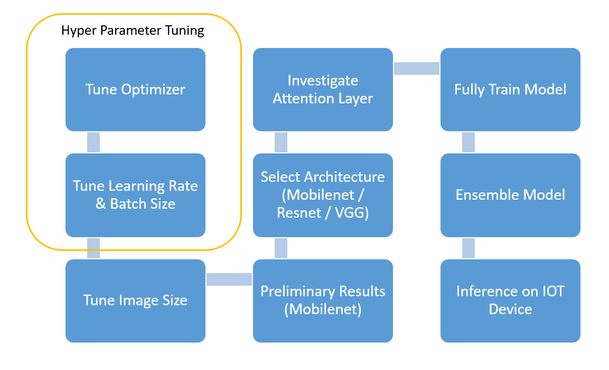

# Background

This dataset was gathered by the NIH and contains over 100,000 anonymized chest x-ray images from more than 30,000 patients. The results shown below are taken from Wang et. al.

The image set involves diagnoses that were scraped from radiology reports and is a multi-label classification problem.  The diagram below shows the proportion of images with multi-labels in each of the 8 pathology classes and the labels' co-occurrence statistics.


Comparison of multi-label classification performance with different model architectures.


Tabulated multi-label classification performance with best results highlighted.


# Data Preparation

The figure below shows the distribution of findings from the diagnoses tied to the x-rays.  Here we see that 60,000 x-rays had no finding.  Therefore, for the purpose of our classification problem, we discard these results.

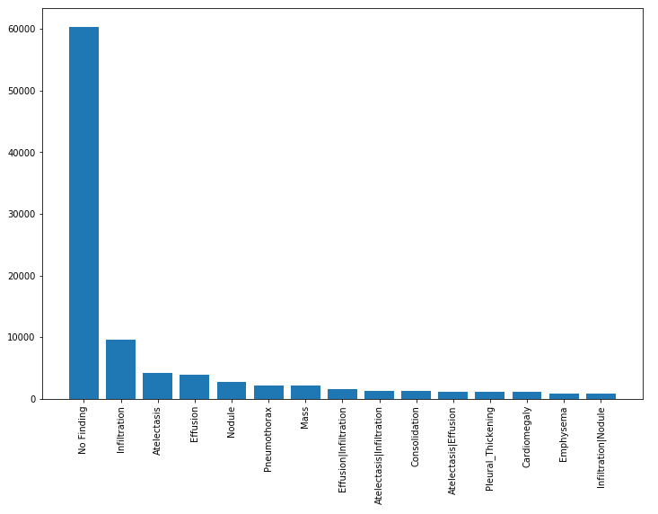

Further, because neural networks rely upon large training sets, we discard any rare diagnoses, that is, we eliminate those with fewer than 1000 occurences.  The resulting distribution of diagnoses is shown below.

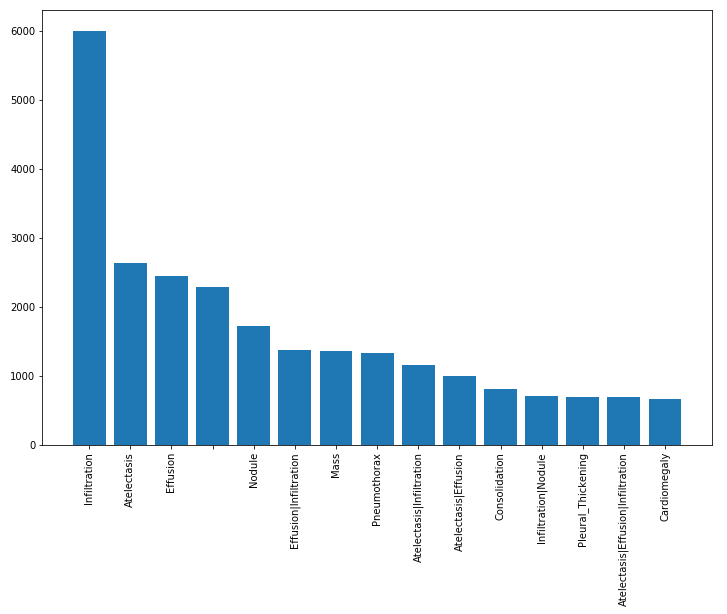

Finally, in order to better understand the distribution of results, we can observe relative frequency to see which diagnoses are most common.

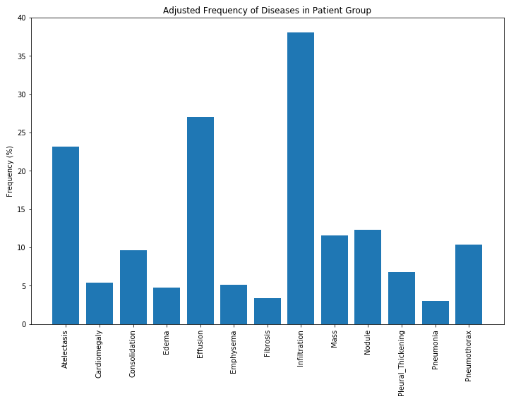

Below are sample images that show different labled types of diagnoses along with their chest x-ray images.

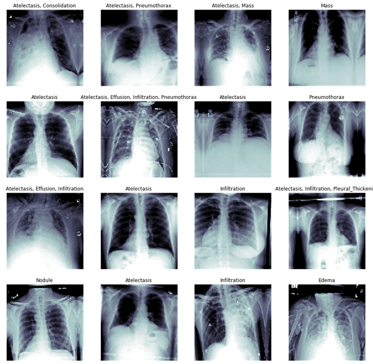

# Results

## Optimizer Selection

While it appears that Adagrad, and adadelt may reach convergence faster, there is no substantially different loss as a result of optimizer selection. When this function was run with larger numbers of training examples per epoch, adam outperformed (graphic not shown). Based on the results shown in the figure above, we can accept the use of adam based on this particular dataset.


## Batch Size and Learning Rate

The table below shows batch size accumulation steps (32 x n) vs learning rate. We can see that our model achieves better loss for learning rates around 0.0005 and with a gradient accumulation step size of 8 or batch size of 256. We observed similar performance for batches both smaller and larger, so we can be confident that batch sizes of 1024, or 2048 would not yield substantially improved performance.  Going forward we can use the ADAM optimizer along with a batch size of 256 using gardient accumulation.

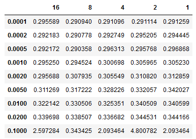

## Image Size


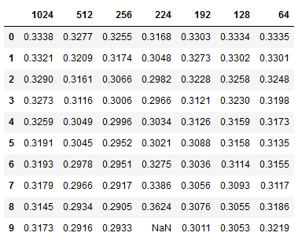

The above table shows image size resolution. Mobile net was designed for (224 x 224). VGG19 was also designed with a native resolution of (224 x 224). However, inceptionV3 resnet was designed with a resolution of (299 x 299). We might expect no improvement in performance beyond the initial design of the network. However, model performance will be dependent upon the particular data set that is being used.  We do in fact see the best perofmrance with images of size (512 x 512). While in comparison, (224 x 224) appears to over-train and result in decreasing performance with validation loss.  Intuitively, we also observe that low resolution images such as (64 x 64) have strictly worse performance.

Therefore, we will go forward with a resolution of (512 x 512), knowing with confidence that we should get results at least as good as using the native resolution of the various models (299 x 299).

Initially we trained the model making use of grayscale images, as X-ray medical images can typically be inferred to not have significant information present in the color channels.  However, this is an assumption that we also test.  Kanan and Cottrell show that the information present in RGB channels and the algorithm used to produce greyscale can be meaningful.

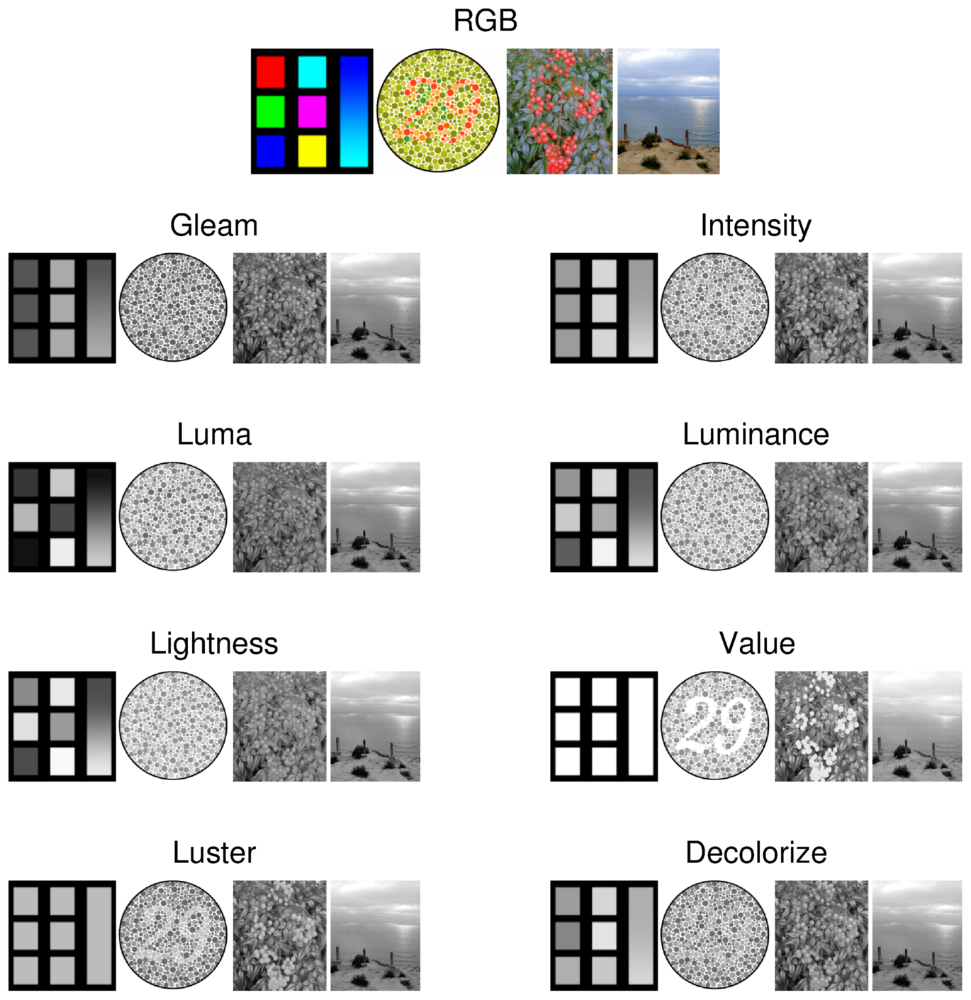

Because grayscale images utilize only a single channel while RGB uses 3 channels, with grayscale we can fit more images in memory and run larger batch sizes.  However, we may be sacrificing model performance by losing information.  As an experiment, a comparison was made between RGB and grayscale images for two different image sizes.  From the figure below we see negligible  performance difference between RGB and grayscale.  For the sake of conservatism, because we are running our model on a V100, we have enough memory that we can use RGB and know that we will get at worst, the same performance as with grayscale.


## Initial Results

Below we can see the results from our initial simple model created in Keras after tuning the various hyper-parameters.  We make use of the mobilenet and add dense layers with a final sigmoid activation for classification prediction.

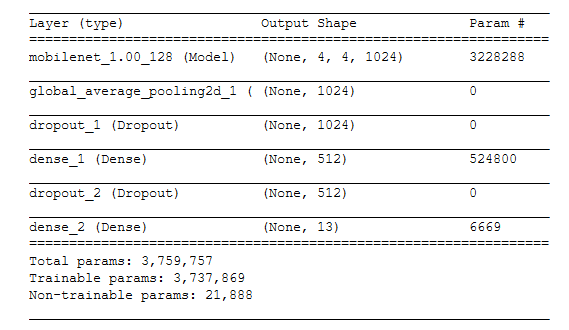

From this model, we can see that not all diagnoses have the same levels of predictive power.  For instance, we can see that we can predict the presence of Edema much more readily than pneumonia.  In fact, at this point we have outperformed the model across almost all of the identified diagnoses classes.  At this point, we will now see how much further improvement we can achieve with other model architectures.

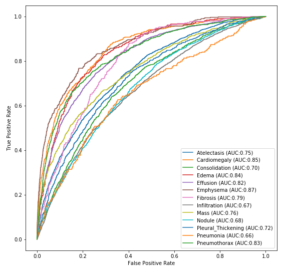

## Model Architectures  

## Attention Layer  

## Train Frozen Model  

## Train Unfrozen Model  

## Ensemble Model  

## Inference on IOT Device  

After the models are fully trained on a powerful machine, in this case, a V100 on the ibmcloud, we may ultimately want to use the models on an internet of things (IOT) device.  This could be extremely useful for applications where interpretation of an X-ray is not easily possible, for instance in a 3rd world country, or a field application such as in the military.

We converted the codebase and containerized the process to easily build and distribute this functionality.  This code base supports both jupyter notebook or command line inference.  For ease of use, shell scripts are used to start and end the container.  Execution of the docker commands is shown below:

### Jupyter Notebook
```
docker run \
--name tensorflow \
--privileged \
-v "$PWD":/content/project \
-v "/media/brent/data":/content/data \
-p 8888:8888 \
--rm \
-ti tensorflow_tx2 \
jupyter notebook --no-browser --port 8888 --ip=0.0.0.0 --allow-root --NotebookApp.token='root' --notebook-dir=/content/
```
### Command Line
```
docker run \
--name tensorflow \
--privileged \
-v "$PWD":/content/project \
-v "/media/brent/data":/content/data \
-p 8888:8888 \
--rm \
-ti tensorflow_tx2 \
/bin/sh -c 'cd content/project; python3 ./inference.py'
```
# Conclusion

We were ultimately able to achieve binary classification performance of XX%.

# Installation

## 1. Provision a cloud GPU machine

### Using AWS

If using AWS, as assumed by these setup instructions, provision an Ubuntu 18.04 `p2.xlarge` instance.  It's got older GPUs (Tesla K80) but is much cheaper.  Make sure to upgrade the storage space (e.g. 500 GB).  Also, make sure to pick a prebuilt Deep Learning AMI during the first step of the provisioning process. The most current version as of writing is `Deep Learning AMI (Ubuntu) Version 23.0 - ami-058f26d848e91a4e8`. This will already have `docker` and `nvidia-docker` pre-installed and will save you a lot of manual installation "fun".

### Using IBM Cloud

Provision a server to run the training code. You can you this server as your development environment too.

Install the CLI, add your ssh public key, and get the key id
```
curl -fsSL https://clis.ng.bluemix.net/install/linux | sh
ibmcloud login
ibmcloud sl security sshkey-add LapKey --in-file ~/.ssh/id_rsa.pub
ibmcloud sl security sshkey-list
```

Provision a V100 using this key id

```
ibmcloud sl vs create \
    --datacenter=wdc07 \
    --hostname=v100a \
    --domain=your.domain.com \
    --image=2263543 \
    --billing=hourly \
    --network 1000 \
    --key={YOUR_KEY_ID} \
    --flavor AC2_8X60X100 --san
```


Wait for the provisioning completion 
```
watch ibmcloud sl vs list
```

SSH on this host to setup the container.

```
ssh -i ~/.ssh/id_rsa {SERVER_IP}
```

>Note:You'll need to check-in your public SSH key in the keys folder and modify the last layer of the dockerfile to get access to the container from VsCode

Need to Add 2 TB secondary Hard-drive to Device via softlayer device list portal.

## 2. Clone the project repo

If you haven't already, clone the project Git repo to your instance.  Doing so in your home directory is convenient, and this document assumes you have done so.

```
cd ~
git clone https://github.com/paloukari/NIH-Chest-X-rays-Classification
```

## 3. Get the data and build the `chest_x_rays_dev` Docker image

Downloading and inflating the data, and building the development container has been automated in the [setup.sh](setup.sh) script.

```
cd ~/NIH-Chest-X-rays-Classification
chmod +x setup.sh
./setup.sh {YOUR_KAGGLE_ID} {YOUR_KAGGLE_KEY}
```

>Note: Get your Kaggle credentials from the Kaggle account page -> **Create New API Token**.
This is neeed to download the data.

## 4. Launch an `chest_x_rays_dev` Docker container

Run the `chest_x_rays_dev` Docker container with the following args.  

> NOTE: update the host volume mappings (i.e. `~/NIH-Chest-X-rays-Classification`) as appropriate for your machine in the following script:

```
sudo docker run \
    --rm \
    --runtime=nvidia \
    --name chest_x_rays_dev \
    -ti \
    -e JUPYTER_ENABLE_LAB=yes \
    -v ~/NIH-Chest-X-rays-Classification:/src \
    -v /data:/src/data \
    -p 8888:8888 \
    -p 4040:4040 \
    -p 32001:22 \
    chest_x_rays_dev
```

You will see it listed as `chest_x_rays_dev ` when you run `docker ps -a`.  

> Note: in the container, run `service ssh restart`, sometimes this is needed too to update the ssh settings.

### Verify Keras can see the GPU

Once inside the container, try running:

```
nvidia-smi
```

If it was successful, you should see a Keras model summary.

### Launch Jupyter Lab in the container

After you've started the container as described above, if you want to _also_ open a Jupyter notebook (e.g. for development/debugging), issue this command:

Inside the container bash, run :

```
jupyter lab --allow-root --port=8888 --ip=0.0.0.0
```

Then go to your browser and enter:

```
http://127.0.0.1:8888?token=<whatever token got displayed in the logs>
```

## 5. (Alternative) Manually setup the container for remote debugging

We need to setup the container to allow the same SSH public key. The entire section could be automated in the dockerfile. We can add our public keys in the repo and pre-authorize us at docker build.

To create a new key in Windows, run:

Powershell: 
```
Add-WindowsCapability -Online -Name OpenSSH.Client~~~~0.0.1.0
ssh-keygen -t rsa -b 4096 
```

The key will be created here: %USERPROFILE%\.ssh

Inside the container, set the root password. We need this to copy the dev ssh pub key.
```
passwd root
```
Install SSH server
```
apt-get install openssh-server
systemctl enable ssh
```
Configure password login
```
vim /etc/ssh/sshd_config
```
Change these lines of /etc/ssh/sshd_config:
```
PasswordAuthentication yes
PermitRootLogin yes
```
Start the service
```
service ssh start
```

Now, you should be able to login from your dev environment using the password.
```
ssh root@{SERVER_IP} -p 32001
```

To add the ssh pub key in the container, from the dev environment run:

```
SET REMOTEHOST=root@{SERVER_IP}:32001
scp %USERPROFILE%\.ssh\id_rsa.pub %REMOTEHOST%:~/tmp.pub
ssh %REMOTEHOST% "mkdir -p ~/.ssh && chmod 700 ~/.ssh && cat /tmp/tmp.pub >> ~/.ssh/authorized_keys && chmod 600 ~/.ssh/authorized_keys && rm -f /tmp/tmp.pub"
```

Test it works:
```
ssh -i ~/.ssh/id_rsa {SERVER_IP} -p 32001
```

Now, you can remove the password root access if you want.

In VsCode, install the Remote SSH extension.
Hit F1 and run VsCode SSH Config and enter 

```
Host V100
    User root
    HostName {SERVER_IP}
    Port 32001
    IdentityFile ~/.ssh/id_rsa
```
Hit F1 and select Remote-SSH:Connect to Host

Once in there, open the NIH-Chest-X-rays-Classification folder, install the Python extension on the container (from the Vs Code extensions), select the python interpreter and start debugging.


## 6. Train the NIH-Chest-X-rays-Classification

### Training

The model is trained through train.py.  The configuration of the models can be changed with a number of helper functions and parameters that are set in params.py.

To train a single model with mobilenet run the train() function in train.py.

To visualize results using tensorboard, use the terminal:
```
tensorboard --logdir=/src/results/tensorboard/single_model/ --port=4040
```

To train multiple models for comparison between mobilenet, VGG, and ResNet run the train_simple_multi() function in train.py.

To visualize results using tensorboard, use the terminal with paths to the models:
```
tensorboard --logdir=mobilenet:/src/results/tensorboard/multi/0/,resnet:/src/results/tensorboard/multi/1/,vgg:/src/results/tensorboard/multi/2/ --port=4040
```

#### Example Tensorboard Outputs


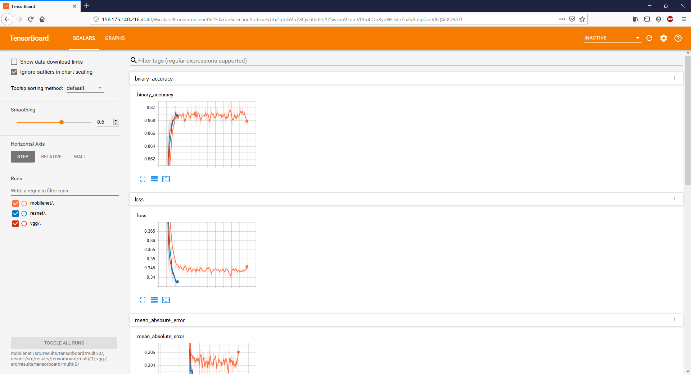

# References

 - Wang X, Peng Y, Lu L, Lu Z, Bagheri M, Summers RM. ChestX-ray8: Hospital-scale Chest X-ray Database and Benchmarks on Weakly-Supervised Classification and Localization of Common Thorax Diseases. [ChestX-ray8: Hospital-scale Chest X-ray Database and Benchmarks on Weakly-Supervised Classification and Localization of Common Thorax Diseases](docs/Wang_ChestX-ray8_Hospital-Scale_Chest_CVPR_2017_paper.pdf).

 - NIH News release: NIH Clinical Center provides one of the largest publicly available chest x-ray datasets to scientific community.  Original source files and documents: https://nihcc.app.box.com/v/ChestXray-NIHCC/folder/36938765345

 - https://www.kaggle.com/nih-chest-xrays/data
 - Kanan C, Cottrell GW (2012) Color-to-Grayscale: Does the Method Matter in Image Recognition? PLoS ONE 7(1): e29740. https://doi.org/10.1371/journal.pone.0029740
